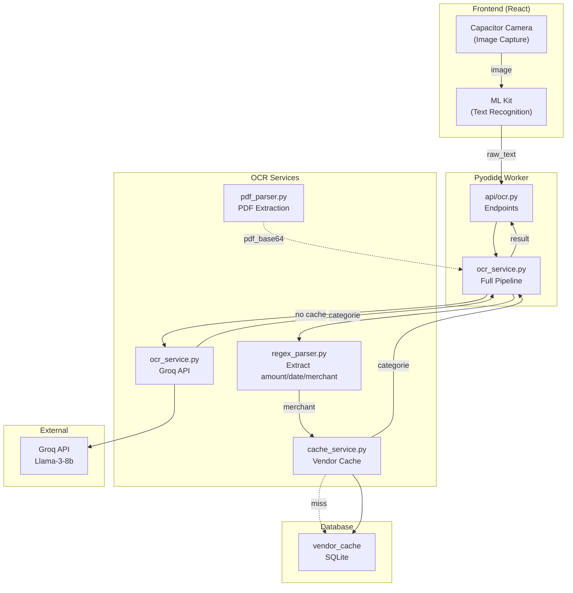
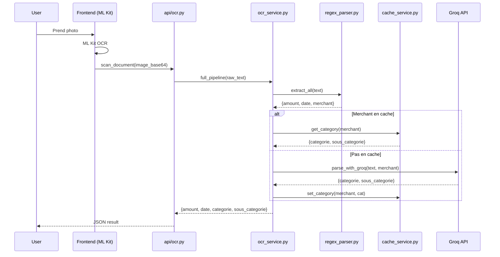
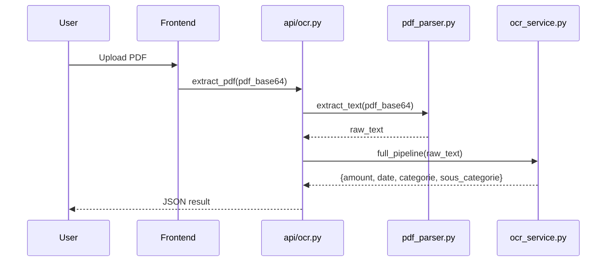

# LOGIC_FLOW - OCR Domain

> Documentation complète du flux de données pour le domaine OCR.

## Vue d'ensemble



## Pipelines détaillées

### Pipeline: Scan ticket (Image)



### Pipeline: Scan PDF



## Composants clés

| Couche | Fichier | Rôle |
|--------|---------|------|
| API | `api/ocr.py` | Endpoints Pyodide |
| Service | `services/ocr_service.py` | Orchestration pipeline |
| Parser | `services/regex_parser.py` | Extraction montant/date/merchant |
| Cache | `services/cache_service.py` | Vendor cache SQLite |
| Parser | `services/pdf_parser.py` | Extraction PDF (pdfminer) |

## Formats d'entrée/sortie

### Entrée API

```python
scan_text(raw_text: str)           # Texte brut OCR
scan_document(image_base64: str)    # Image (non implémenté)
extract_pdf(pdf_base64: str)        # PDF base64
```

### Sortie

```python
{
    "amount": 42.50,           # float ou None
    "date": "2026-03-15",     # ISO date ou None
    "merchant": "Carrefour",  # str ou None
    "categorie": "Alimentation",
    "sous_categorie": "Supermarché"
}
```

## Vendor Cache

Table SQLite: `vendor_cache`

```sql
CREATE TABLE vendor_cache (
    id INTEGER PRIMARY KEY AUTOINCREMENT,
    merchant_name TEXT UNIQUE NOT NULL,
    categorie TEXT NOT NULL,
    sous_categorie TEXT,
    last_updated TEXT NOT NULL
);
```

## Configuration

- **Groq API Key**: Variable d'environnement `GROQ_API_KEY`
- **pdfminer.six**: Dépendance optionnelle pour PDF (test Pyodide requis)

## Notes

- ML Kit côté frontend fait l'extraction texte
- Backend Python fait: regex → cache → Groq → result
- vendor_cache réduit les appels Groq de ~90%
