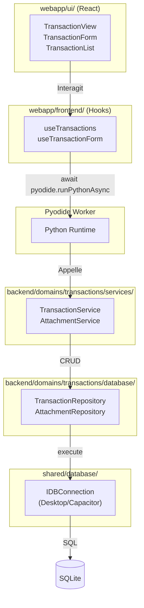
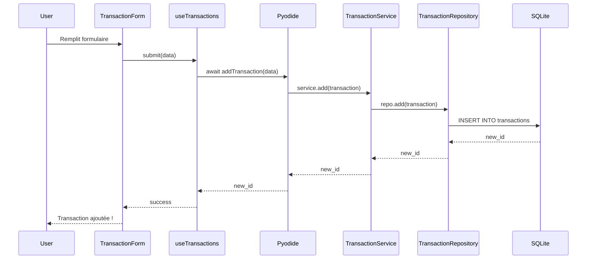
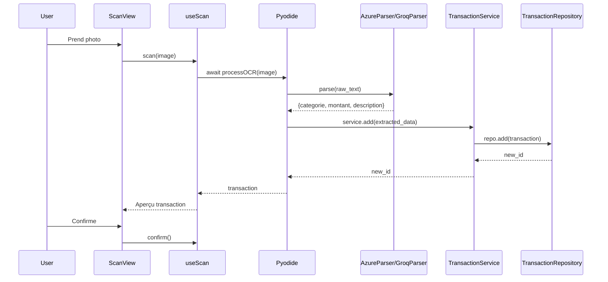
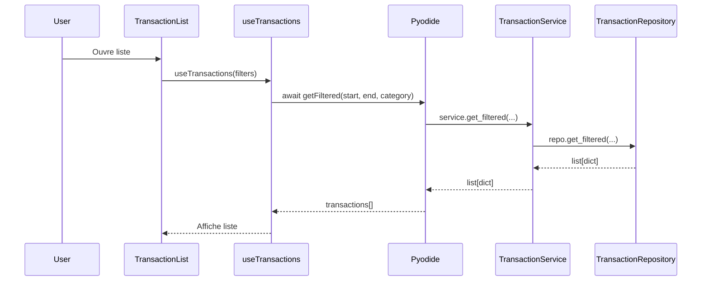

# LOGIC_FLOW - Transactions

> Documentation complète du flux de données pour le domaine Transactions.

## Vue d'ensemble (TOUTE la pipeline)

## Pipelines détaillées

### Pipeline: Ajouter une transaction

### Pipeline: Scanner un ticket (OCR)

### Pipeline: Consulter les transactions

## Composants clés

| Couche | Fichier | Rôle |
|--------|---------|------|
| UI | `webapp/ui/domains/transactions/` | Composants React |
| Hook | `webapp/frontend/domains/transactions/useTransactions.ts` | Bridge Python↔React |
| Service | `backend/domains/transactions/services/transaction_service.py` | Logique métier |
| Repo | `backend/domains/transactions/database/repository_transaction.py` | CRUD SQLite |

## Notes

- **Pas de Pandas dans Pyodide** → retourne `list[dict]`
- **Pyodide toujours dans Web Worker** → async only
- **OCR offline** : ML Kit via Capacitor
- **OCR online** : Azure Vision API
