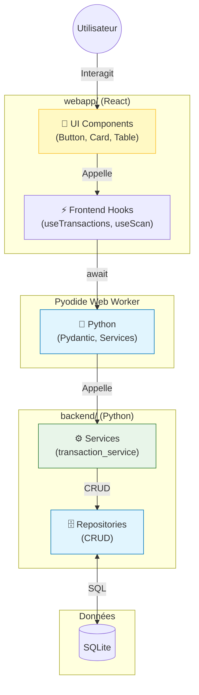

# 💰 Domaine Transactions

> Centre nerveux de l'application. Gère toutes les opérations financières (dépenses, revenus, virements).

> 📍 **Voir le flux complet** : [LOGIC_FLOW.md](LOGIC_FLOW.md)

## 🗺️ Carte du Module

| Dossier | Rôle | Documentation |
|:---------|:-----|:-------------|
| **`database/`** | Données (Schéma SQL, Repositories) | [📄 Lire la doc](database/README.md) |
| **`services/`** | Logique métier | [⚙️ Lire la doc](services/README.md) |
| **`recurrence/`** | Moteur Temporel (Abonnements, Échéances) | [🔄 Lire la doc](recurrence/README.md) |
| **`ocr/`** | Intelligence Artificielle (Scan tickets/PDF) | [👁️ Lire la doc](ocr/services/README.md) |
| **`view/`** | Composants visuels React | [🎨 Lire la doc](view/README.md) |

---

## 🏗️ Architecture

### Avec React + Pyodide



---

## 🔑 Règles Importantes

1. **Pas de SQL dans webapp/** — tout passe par le Repository Python
2. **Pyodide dans Web Worker** — toujours async (`await pyodide.runPythonAsync()`)
3. **Pas de Pandas dans Pyodide** — utiliser `cursor.fetchall()` ou listes de dictionnaires
4. **OCR** : ML Kit (offline) + Azure Vision API (online)

---

## 📁 Structure

```
transactions/
├── database/
│   ├── model.py              # Transaction (Pydantic)
│   ├── model_recurrence.py  # Récurrence
│   ├── model_attachment.py   # Pièce jointe
│   ├── repository.py         # CRUD transactions
│   ├── repository_recurrence.py
│   ├── repository_attachment.py
│   ├── schema.py            # Migrations tables
│   └── constants.py         # Catégories
│
├── services/
│   ├── transaction_service.py
│   └── attachment_service.py
│
├── recurrence/
│   └── recurrence_service.py
│
└── ocr/
    ├── core/                # Moteurs OCR
    └── services/            # Service OCR + patterns
```

---

## 🚀 Guide Rapide

### Je veux modifier...

- **L'ajout d'une transaction ?**
  👉 [`services/transaction_service.py`](services/transaction_service.py)

- **La détection des prix sur les tickets ?**
  👉 [`ocr/services/pattern_manager.py`](ocr/services/pattern_manager.py)

- **Le calcul des mensualités d'abonnement ?**
  👉 [`recurrence/recurrence_service.py`](recurrence/recurrence_service.py)
