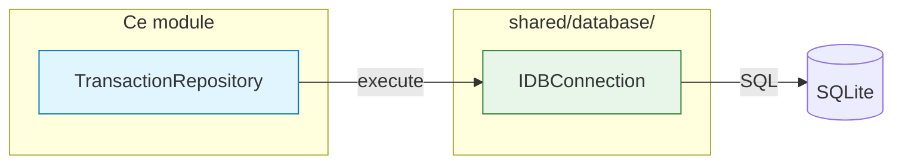
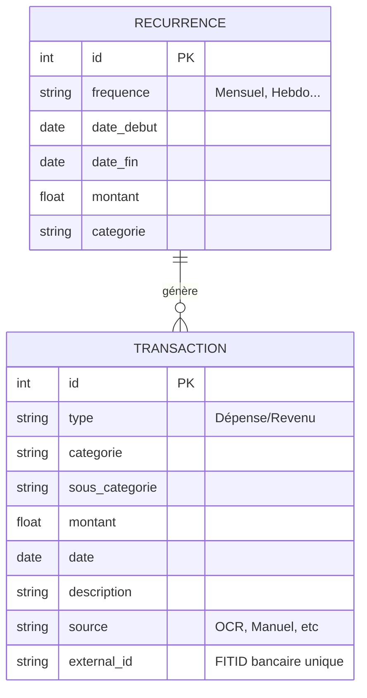

# Architecture Données (Database)

> Couche de persistance utilisant le pattern **Repository**.

> 📍 Position dans le flux : voir [LOGIC_FLOW.md](../LOGIC_FLOW.md)



## 🗄️ Schéma de Données (ER Diagram)



## 🛠️ Pattern Repository

L'accès direct SQL est interdit dans les couches supérieures. On passe par les repositories.

### `TransactionRepository`

- **Mapping** : Convertit les lignes SQL en objets Python (`Transaction`)
- **Validation** : Vérifie l'intégrité des données via Pydantic

> ⚠️ **Pas de Pandas dans Pyodide** — utiliser `cursor.fetchall()` retourne des listes de dictionnaires

```python
# Au lieu de pandas
rows = cursor.fetchall()  # -> list[dict]
return [dict(row) for row in rows]
```

### `RecurrenceRepository`

- Gère le cycle de vie des abonnements
- Projette les futures occurrences

## 🛡️ Sécurité & Intégrité

- **Unicité** : Le champ `external_id` (indexé UNIQUE) empêche les doublons
- **Types** : Montants en `REAL`, dates en `TEXT` (ISO 8601)
- **Foreign Keys** : Activées via `PRAGMA foreign_keys = ON`
