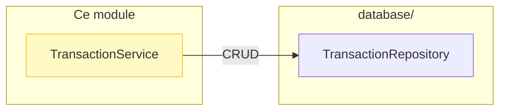
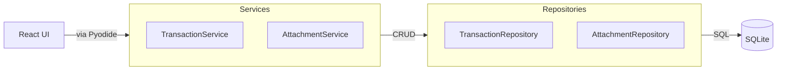

# Services (Logique Métier)

> Couche service qui fait le lien entre la **UI React** et les **Repositories**.

> 📍 Position dans le flux : voir [LOGIC_FLOW.md](../LOGIC_FLOW.md)

## 🎯 Rôle

Les Services encapsulent la **logique métier** :

- Transformation de données (mapping, conversion)
- Appels aux Repositories
- Logique complexe (calculs, agrégations)
- Orchestration de plusieurs opérations

## 📂 Contenu

| Fichier | Responsabilité |
|---------|----------------|
| **`transaction_service.py`** | Lecture/filtrage des transactions |
| **`attachment_service.py`** | Gestion des fichiers joints (tickets, PDF) |

## 🔄 Flux de données

## 📋 Méthodes par Service

### TransactionService

- `get_transaction_by_id(tx_id)` → Transaction | None
- `get_all()` → List[dict]
- `get_filtered(start, end, category)` → List[dict]

> ⚠️ **Pas de DataFrames** — retourne des listes de dictionnaires pour Pyodide

### AttachmentService

- `add_attachment(...)` → int | None
- `get_attachments(transaction_id)` → List[Attachment]
- `delete_attachment(attachment_id)` → bool

## ⚡ Point important

Les Services **ne font pas de SQL direct**. Ils délèguent tout au Repository.

Voir aussi :
- [README principal du domaine](../README.md)
- [Database README](../database/README.md)
